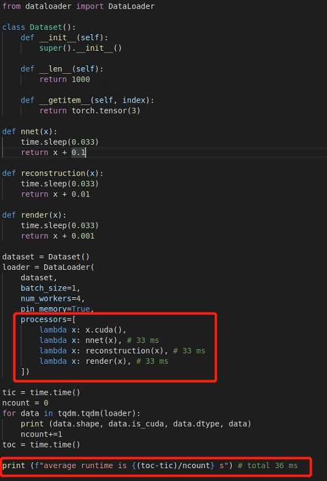

# Dataloader.async
A asynchronous pytorch Dataloader for general neural network pipeline accelaration.

<div align="center">

<p> Our dataloader is fully compatible with offical Dataloader, with extension that allows aynsc processors.</p>
</div>

## Usage:

```
$ python setup.py install
```

then

```
from dataloaderAsync import DataLoader

...
```

* Note: Only tested on pytorch 1.3.0. Should be able to compatible with older versions.
